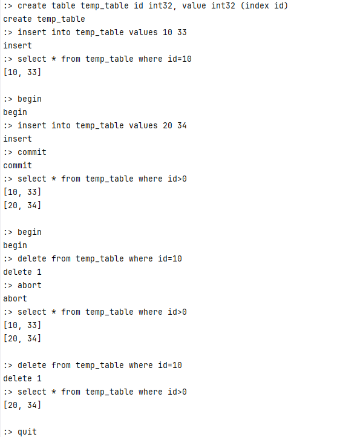
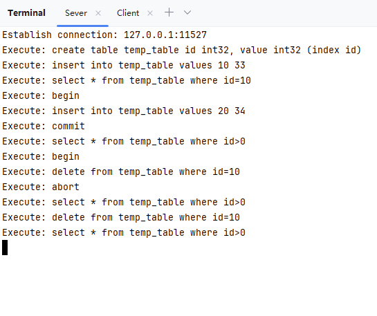

# MiniDB

MiniDB 是一个 Java 实现的简单的数据库，部分原理参照自 MySQL、PostgreSQL 和 SQLite。实现了以下功能：

- 数据的可靠性和数据恢复
- 两段锁协议（2PL）实现可串行化调度
- MVCC
- 两种事务隔离级别（读提交和可重复读）
- 死锁处理
- 简单的表和字段管理
- 简单的SQL解析
- 基于 socket 的 server 和 client

## 运行方式

注意首先需要在 pom.xml 中调整编译版本，如果导入 IDE，请更改项目的编译版本以适应你的 JDK

首先执行以下命令编译源码：

```shell
mvn compile
```

接着执行以下命令以 /tmp/minidb 作为路径创建数据库：
无法创建中间路径 需要提前创建temp文件夹

```shell
mvn exec:java -D"exec.mainClass"="com.kevin.minidb.backend.Launcher" -D"exec.args"="-create D:\temp\minidb"
```

随后通过以下命令以默认参数启动数据库服务：

```shell
mvn exec:java -D"exec.mainClass"="com.kevin.minidb.backend.Launcher" -D"exec.args"="-open D:\temp\minidb"
```

这时数据库服务就已经启动在本机的 9999 端口。重新启动一个终端，执行以下命令启动客户端连接数据库：

```shell
mvn exec:java -D"exec.mainClass"="com.kevin.minidb.client.Launcher"
```

会启动一个交互式命令行，就可以在这里输入类 SQL 语法，回车会发送语句到服务，并输出执行的结果。

一个执行示例：



